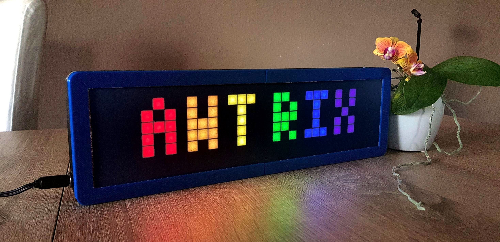
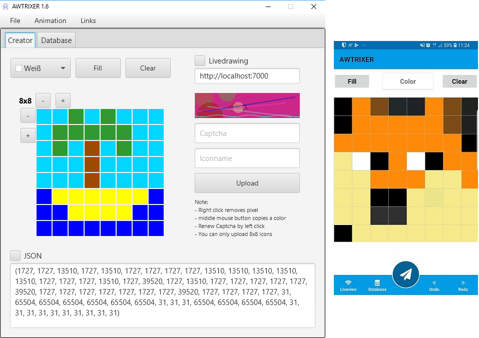

# AWTRIX 2.0

AWTRIX 2.0 (AWesome maTRIX) is an DIY intelligent clock (similar to Lametric time) with a focus on usability, Smarthome integrity and tons of features. I was able to make AWTRIX 2.0 a great user experience. It starts with the simple setup and installation and ends with the intuitive operation. AWTRIX 2.0 is the result of 3 months of hard work and very good feedback from the community. [Here you can find some nice Pictures from the Community!](https://forum.blueforcer.de/d/22-show-your-awtrix)

**Review from a AWTRIX user**
<iframe width="560" height="315" src="https://youtube.com/embed/MgdMpw16RnM?rel=0" frameborder="0" allow="autoplay; encrypted-media" allowfullscreen></iframe>  

AWTRIX 2.0 consists of a ESP8266 as Matrix Driver (AWTRIX Controller) for the 32×8 full color RGB matrix, and any Java capable Server like Windows, MacOS, Raspberry Pi, etc. The Server takes over the complete logic while the ESP takes over the commands and displays them stubbornly.

AWTRIX 2.0 is completely free to use. Some premium functions will be available later in a cheap subscription. Until then this can also be used free of charge.

**AWTRIX 2.0 offers many features:**
- Platform independent
- Complete configuration over Webinterface
- Apps can be added through the integrated Appstore.
- Flexible App management
- Support for Community Apps
- powerful API interfaces like MQTT and REST
- Optional cloud connection for external services such as IFTTT (https://awtrix.blueforcer.de/)
- full control via Smarthome or web interface
- Automatic brightness control
- Timer and stopwatch function
- Fritz!Box Callmonitor
- Telegrambot
- AWTRIX nodes to build up your own litte Smarthome
- Supports USB or Wifi connection to the Matrix

**Example of the powerful drawing API:**

<iframe width="560" height="315" src="https://youtube.com/embed/BfqCBOx3_qQ?rel=0" frameborder="0" allow="autoplay; encrypted-media" allowfullscreen></iframe>  
  
  
[**You will find all available Apps here**](https://awtrix.blueforcer.de/apps.html)

  
  
  
You can also create your own Icons with AWTRIXER! Use it for own Apps or temporary Apps from external Systems like Smarthome!  
Available for Windows, MacOS, Linux, Android and iOS! You can also upload your Icons for the Community.

