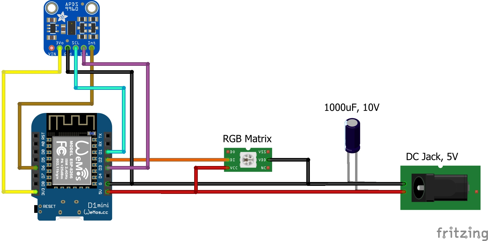
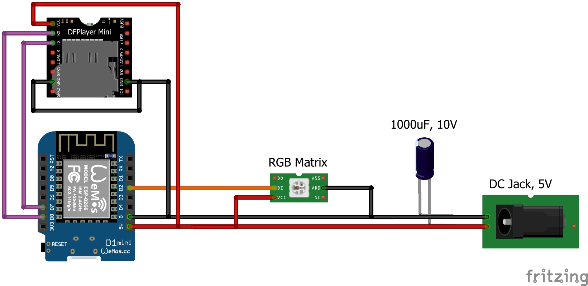

# **Electronic**

The electronics can either be soldered to a breadboard or wired "overhung". (PCB may still be available for a small fee in the future)

Soldering directly to the matrix can have fatal consequences, as the flexible PCB and especially the LEDs are extremely heat-sensitive. Leave the cable at the input (DI,5V,GND) and cut off only the plug. If your matrix has an output (DO), you can remove it completely.
Before soldering the socket for the power supply, screw it to the housing with 2 soldered wires.

## CORE Setup
***Core setup:***   


## LDR (Light Dependent Resistor)
***Optional LDR setup:***  


## Gesture
***Optional Gesture setup:***  


You can control AWTRIX with Hand gestures (Only switching between Apps for now) with a APDS-9960 Gesture Sensor
Please keep in mind that the Housing is not prepared for mounting this sensor. You will have to do it by your own.
  
!> IMPORTANT: The APDS-9960 can only accept 3.3V!

| Wemos | APDS-9960 | Function |
| --- | --- | --- |
|3.3V|VCC|Power|
|GND|GND|Ground|
|D3|SDA|I2C Data|
|D1|SCL|I2C Clock|
|D6|INT|Interrupt|  


## DFPlayer Mini
***Optional DFPlayer Mini setup:***  
   

| Wemos | DFPlayer Mini | Function |
| --- | --- | --- |
|5V|VCC|Power|
|G|GND|Ground|
|D7|TX|Transmit|
|D8|RX|Receive|   


## Connecting a Raspberry to the Wemos via Serial
If you have problems, stuttering with the WifiConnection, or just dont want to use Wifi from Server to Matrix you can use the Serial Connection to transmit the Data to the Matrix.

First you need to activate Serial communication in the AWTRIXController Firmware by uncomment //#define USB_CONNECTION

You can use the **USB Port** of the Pi (Also for any other Serverplatform).
by simply connect ja microUSB cable from Raspberry to the Wemos D1. Then you need to enable USBMatrix in the settingsmenu via webinterface and set the USBPort to **/dev/ttyUSB0** (Thats the default port for Raspberry). Then restart the Server.

  
You are also able to use the **GPIO´s** to connect the Pi to the Wemos:
  
| Raspberry Pin | WEmos|
| --- | --- |
|04 5V |5V|
|06 GND|GND|
|08 TXD|RX|
|10 RXD|TX|

Then you need enable the Serial Pins by putting the folliwing line to
File /boot/config.txt   
``` enable_uart=1 ```

As USBPort you need to enter **/dev/ttyS0** in the Settingsmenu via Webinterface. Then restart the Server.
