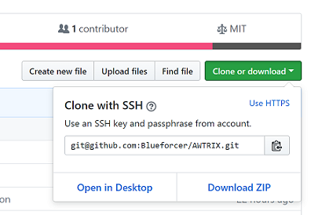
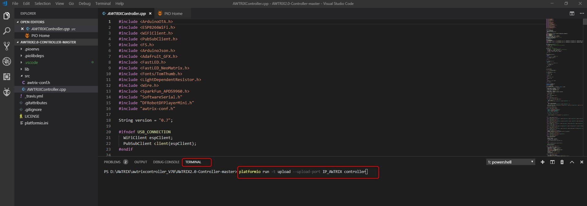

## **IDE**

Platform.IO is used to edit and upload the firmware.
The underlying IDE (Atom, Visual Studio Code) does not matter.
However, this manual is based on Visual Studio Code(VSC) and may need to be adapted.
The installation of the IDE is described in the following link:
[https://platformio.org/platformio-ide](https://platformio.org/platformio-ide)

## **Download and open firmware**

The firmware can be downloaded from github as a ZIP file
[https://github.com/awtrix/AWTRIX2.0-Controller](https://github.com/awtrix/AWTRIX2.0-Controller)


Unzip the ZIP file with a suitable unpacker and open the folder in Visual Studio Code.

## **Setup**

Before flashing the Firmware, open **\src\awtrix-conf.h** and edit your wifi credentials and set the IP from the Server wich should run the serverapplication.  If you using a LDR for automatic brightness control, you also need to modify the LDR section. if not, just ignore it.

 Then simply flash the firmware. In VSC, this is done in the blue line at the bottom of the window:  


## **OTA(Over the air) Update**
AWTRIX Controller supports over-the-air updates. 
PlatformIO Terminal:  
(Replace IP in below command line with your own IP of the AWTRIX controller)  
```platformio run -t upload --upload-port 192.168.178.96```  
Please note: First OTA only works after ESP reset  

  
